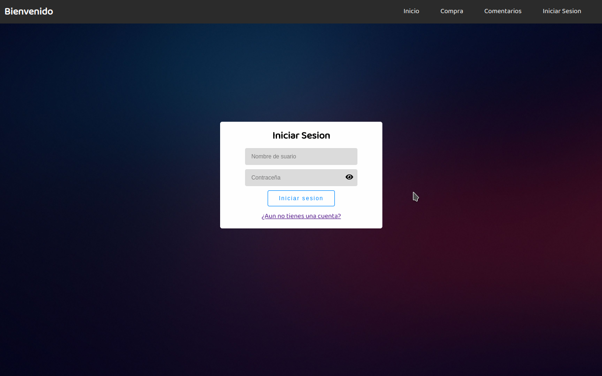

# Proyecto de inventario

_Este proyecto esta desarrollado con fines educativos, y funciona de la siguiente manera: Un usuario inicia sesion la cual maneja una **Cookie** que se guarda en el navegador del cliente para que recuerde que el navegador sepa que hay un usuario registrado y no se pierda la sesión en las distintas rutas que maneja el servidor, luego el usuario puede hacer una compra que se guarda en un registro temporal de la cual el usuario puede terminar en cualquier momento, preguntara si desea guardar una vista previa de la factura correspondiente en formato PDF o si solo desea continuar, y las compras que realize se guardan en un historial de compras que es donde estarán todos los registros de compras._



## Comenzando 🚀
_Estas instrucciones te permitirán obtener una copia del proyecto en funcionamiento en tu máquina local para propósitos de desarrollo y pruebas._

### Pre-requisitos
Que cosas necesitas para instalar el software

* Mongo DB o Mongo DB Compass Instalado

* Node.js Instalado

* Git Instalado

* Si estas en Windows, Mongo DB y Node.js tienen que estar en el path para que pueda ser ejecutado

### Instalacion 🔧
_Serie de pasos para ejecutar en local y en entorno de desarrollo_

* Estar en la carpeta del Archivo clonado
* Abrir consola de comandos -- Windows/Linux/Mac

#### Clonar el repositorio o descargar el ZIP
```
git clone https://github.com/denis360/Inventary-proyect.git
```

#### Iniciar Mongo Db
* En una terminal de comandos ejecutar
```
mongod
```

#### Instalar dependencias correspondientes
* En otra terminal de comandos ir a la carpeta y ejecutar
```
npm install
```

#### Iniciar en local y en entorno de desarrollo 🛠
```
npm run dev
```

* Ir a tu navegador a la ruta http://localhost:8000

## Construido con:
* [Node.js](https://nodejs.org/es/)
* [Mongo Db](https://www.mongodb.com/es)
* [Express](https://expressjs.com/es/)
* [Handlebars](https://handlebarsjs.com/)
